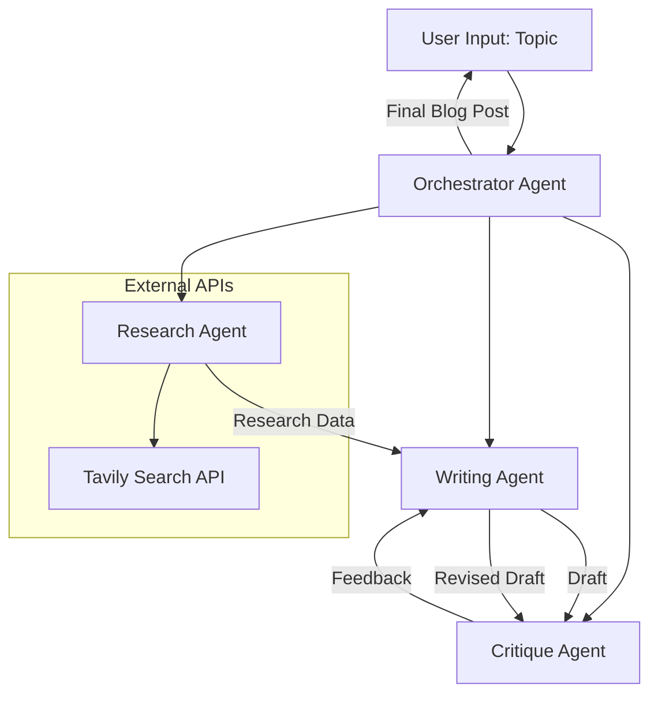
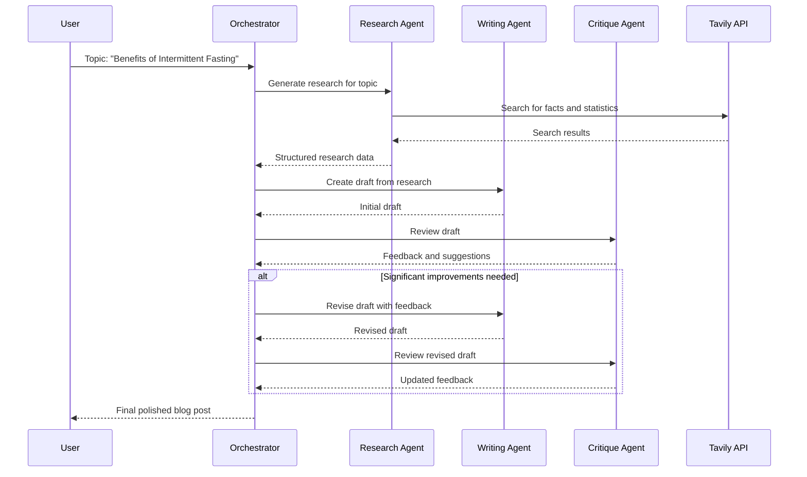

# Design Document

## Overview

The AI Blog Post Generation Team is a multi-agent system built with Pydantic AI that orchestrates specialized agents to produce high-quality blog posts. The system uses agent delegation patterns where an Orchestrator coordinates between Research, Writing, and Critique agents through an iterative workflow.

The architecture leverages Pydantic AI's agent framework for type-safe interactions, structured outputs, and robust error handling. Each agent is specialized for a specific task and communicates through well-defined interfaces using Pydantic models.

## Architecture

### High-Level Architecture



### Agent Delegation Flow



## Components and Interfaces

### Core Data Models

```python
from pydantic import BaseModel, Field
from typing import List, Optional, Literal
from enum import Enum

class ResearchFinding(BaseModel):
    """Individual research finding with source attribution"""
    fact: str = Field(description="The factual information found")
    source_url: str = Field(description="URL of the source")
    relevance_score: float = Field(ge=0, le=1, description="Relevance to topic")
    category: str = Field(description="Category of information (statistic, study, expert_opinion, etc.)")

class ResearchOutput(BaseModel):
    """Structured output from Research Agent"""
    topic: str = Field(description="The research topic")
    findings: List[ResearchFinding] = Field(description="List of research findings")
    summary: str = Field(description="Brief summary of key insights")
    confidence_level: float = Field(ge=0, le=1, description="Confidence in research quality")

class BlogDraft(BaseModel):
    """Blog post draft structure"""
    title: str = Field(description="Blog post title")
    introduction: str = Field(description="Opening paragraph")
    body_sections: List[str] = Field(description="Main content sections")
    conclusion: str = Field(description="Closing paragraph")
    word_count: int = Field(description="Approximate word count")

class CritiqueSeverity(str, Enum):
    MINOR = "minor"
    MODERATE = "moderate"
    MAJOR = "major"

class CritiqueFeedback(BaseModel):
    """Individual piece of feedback"""
    section: str = Field(description="Which section the feedback applies to")
    issue: str = Field(description="Description of the issue")
    suggestion: str = Field(description="Specific improvement suggestion")
    severity: CritiqueSeverity = Field(description="Severity of the issue")

class CritiqueOutput(BaseModel):
    """Structured output from Critique Agent"""
    overall_quality: float = Field(ge=0, le=10, description="Overall quality score")
    feedback_items: List[CritiqueFeedback] = Field(description="Specific feedback items")
    approval_status: Literal["approved", "needs_revision"] = Field(description="Whether draft is approved")
    summary_feedback: str = Field(description="Overall assessment summary")

class BlogGenerationResult(BaseModel):
    """Final result from the blog generation process"""
    final_post: BlogDraft = Field(description="The final blog post")
    research_data: ResearchOutput = Field(description="Research used")
    revision_count: int = Field(description="Number of revision cycles")
    total_processing_time: float = Field(description="Total time in seconds")
    quality_score: float = Field(description="Final quality assessment")
```

### Agent Dependencies

```python
from dataclasses import dataclass
from tavily import TavilyClient
import httpx

@dataclass
class SharedDependencies:
    """Shared dependencies across all agents"""
    http_client: httpx.AsyncClient
    tavily_client: TavilyClient
    max_iterations: int = 3
    quality_threshold: float = 7.0
```

### Agent Definitions

#### Research Agent
- **Model**: `google-gla:gemini-1.5-flash` (cost-effective for research tasks)
- **Purpose**: Gather comprehensive research on the given topic
- **Tools**: 
  - `search_web`: Uses Tavily API for web search
  - `extract_facts`: Processes search results into structured findings
- **Output**: `ResearchOutput` with structured findings and confidence metrics

#### Writing Agent  
- **Model**: `openai:gpt-4o` (high-quality writing capabilities)
- **Purpose**: Create well-structured blog posts from research data
- **Tools**:
  - `structure_content`: Organizes information into blog sections
  - `enhance_readability`: Improves flow and readability
- **Output**: `BlogDraft` with structured content sections

#### Critique Agent
- **Model**: `openai:gpt-4o` (strong analytical capabilities)
- **Purpose**: Provide editorial feedback and quality assessment
- **Tools**:
  - `analyze_clarity`: Checks for clear communication
  - `verify_facts`: Cross-references claims with research
  - `assess_structure`: Evaluates content organization
- **Output**: `CritiqueOutput` with detailed feedback and approval status

#### Orchestrator Agent
- **Model**: `openai:gpt-4o` (coordination and decision-making)
- **Purpose**: Coordinate the multi-agent workflow
- **Tools**:
  - `delegate_research`: Calls Research Agent
  - `delegate_writing`: Calls Writing Agent  
  - `delegate_critique`: Calls Critique Agent
  - `make_revision_decision`: Determines if revision is needed
- **Output**: `BlogGenerationResult` with final post and metadata

## Data Models

### Research Data Flow
1. **Input**: Topic string from user
2. **Processing**: Tavily API search results → structured findings
3. **Output**: Categorized research with relevance scoring

### Writing Data Flow  
1. **Input**: `ResearchOutput` + topic
2. **Processing**: Content structuring → draft generation
3. **Output**: `BlogDraft` with organized sections

### Critique Data Flow
1. **Input**: `BlogDraft` + original `ResearchOutput`
2. **Processing**: Multi-dimensional analysis (clarity, accuracy, structure)
3. **Output**: `CritiqueOutput` with actionable feedback

### Orchestration Data Flow
1. **Input**: User topic
2. **Processing**: Sequential agent delegation with iteration control
3. **Output**: `BlogGenerationResult` with complete metadata

## Error Handling

### Agent-Level Error Handling
- **ModelRetry**: Used for recoverable errors (API timeouts, temporary failures)
- **Validation Errors**: Pydantic model validation ensures data integrity
- **Timeout Handling**: Configurable timeouts for each agent interaction
- **Fallback Strategies**: Alternative approaches when primary methods fail

### System-Level Error Handling
```python
class BlogGenerationError(Exception):
    """Base exception for blog generation errors"""
    pass

class ResearchError(BlogGenerationError):
    """Research phase failed"""
    pass

class WritingError(BlogGenerationError):
    """Writing phase failed"""
    pass

class CritiqueError(BlogGenerationError):
    """Critique phase failed"""
    pass
```

### Retry Logic
- **Research Agent**: Up to 3 retries for API failures
- **Writing Agent**: Up to 2 retries for generation issues
- **Critique Agent**: Up to 2 retries for analysis failures
- **Exponential Backoff**: Implemented for API rate limiting

### Graceful Degradation
- If research is limited, proceed with available data
- If critique fails, use basic quality checks
- Preserve intermediate results for debugging

## Testing Strategy

### Unit Testing
- **Agent Tools**: Test individual tool functions in isolation
- **Data Models**: Validate Pydantic model serialization/deserialization
- **Error Handling**: Test exception scenarios and recovery
- **API Mocking**: Mock external API calls for consistent testing

### Integration Testing
- **Agent Delegation**: Test agent-to-agent communication
- **End-to-End Workflow**: Complete topic → blog post flow
- **Error Propagation**: Test error handling across agent boundaries
- **Performance**: Measure response times and resource usage

### Test Data Strategy
```python
# Test fixtures for consistent testing
TEST_TOPICS = [
    "Benefits of Intermittent Fasting",
    "Climate Change Impact on Agriculture", 
    "Future of Remote Work",
    "Artificial Intelligence in Healthcare"
]

MOCK_RESEARCH_DATA = {
    "intermittent_fasting": ResearchOutput(...),
    "climate_change": ResearchOutput(...),
    # ... additional test data
}
```

### Quality Assurance
- **Content Quality Metrics**: Readability scores, fact accuracy
- **Performance Benchmarks**: Response time targets per agent
- **Usage Tracking**: Token consumption and cost monitoring
- **A/B Testing**: Compare different model combinations

### Monitoring and Observability
- **Logfire Integration**: Comprehensive logging of agent interactions
- **Usage Tracking**: Monitor token consumption across agents
- **Performance Metrics**: Track processing times and success rates
- **Error Analytics**: Categorize and analyze failure patterns

This design provides a robust, scalable foundation for the AI Blog Generation Team system, leveraging Pydantic AI's strengths in type safety, agent coordination, and structured outputs.